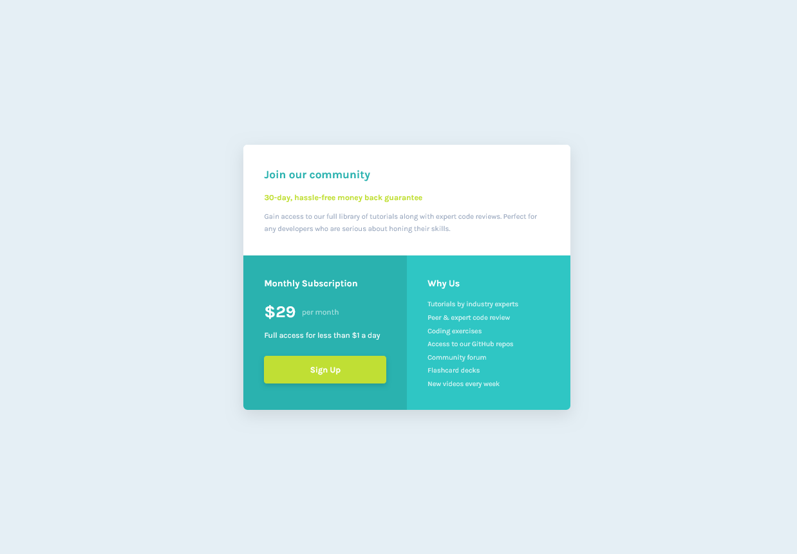

# Single price grid component

This is a solution to the [Single price grid component challenge on Frontend Mentor](https://www.frontendmentor.io/challenges/single-price-grid-component-5ce41129d0ff452fec5abbbc). 
## Table of contents

- [Overview](#overview)
  - [The challenge](#the-challenge)
  - [Screenshot](#screenshot)
  - [Links](#links)
- [My process](#my-process)
  - [Built with](#built-with)
  - [What I learned](#what-i-learned)
  - [Continued development](#continued-development)
  - [Useful resources](#useful-resources)
- [Author](#author)

## Overview

### The challenge

Users should be able to:

- View the optimal layout for the component depending on their device's screen size
- See a hover state on desktop for the Sign Up call-to-action

### Screenshot



### Links

- Solution URL: [https://github.com/Henrydevlab/single-price-component](https://github.com/Henrydevlab/single-price-component)
- Live Site URL: [https://henrydevlab.github.io/single-price-component/](https://henrydevlab.github.io/single-price-component/)

## My process

### Built with

- Semantic HTML5 markup
- CSS custom properties
- Flexbox
- CSS Grid
- Mobile-first workflow
- BEM

### What I learned

During this project, I reinforced my knowledge of writing clean, scalable CSS by strictly adhering to the BEM methodology. This kept my specificity low and predictable. 

I am particularly proud of implementing **CSS Logical Properties** instead of traditional physical directional properties, which ensures the card layout scales naturally across different writing modes:

```css
/* Explicit, self-contained element padding with logical properties */
.price-card__intro,
.price-card__subscription,
.price-card__features {
  padding: 1.5rem;
}

/* Margin handling for content distribution */
.price-card__title {
  color: var(--clr-teal-500);
  font-size: 1.25rem;
  margin-block-end: 1.25rem;
}
```

I also practiced a strict mobile-first grid system. By treating the layout as a single-column block initially, I was able to transition smoothly to a side-by-side split layout on larger viewports with just a few lines of code inside a media query:

```CSS
@media (min-width: 620px) {
  .price-card {
    grid-template-columns: 1fr 1fr;
  }

  .price-card__intro {
    grid-column: span 2;
  }
}
```
### Continued development

In future projects, I want to keep focusing on:

- Web Accessibility (a11y): Ensuring that even small components are completely navigable with keyboards and fully optimized for screen readers by leveraging appropriate ARIA descriptions and hiding structural landmarks gracefully via `sr-only`.
- Advanced Grid Layouts: Perfecting fractional units and alignment properties to avoid having to change explicit widths manually as screens expand.

### Useful resources

- [MDN Web Docs - CSS Logical Properties](https://developer.mozilla.org/en-US/docs/Web/CSS/Guides/Logical_properties_and_values) - This helped me understand why moving away from margin-bottom or padding-left toward logical mappings makes layouts future-proof.
- [BEM Introduction](https://bem.info/en/methodology/quick-start/) - A great breakdown of the naming philosophy that helped me keep my style sheets highly readable and easy to scan.

## Author

- Twitter - [@henrydevlab](https://www.twitter.com/henrydevlab)